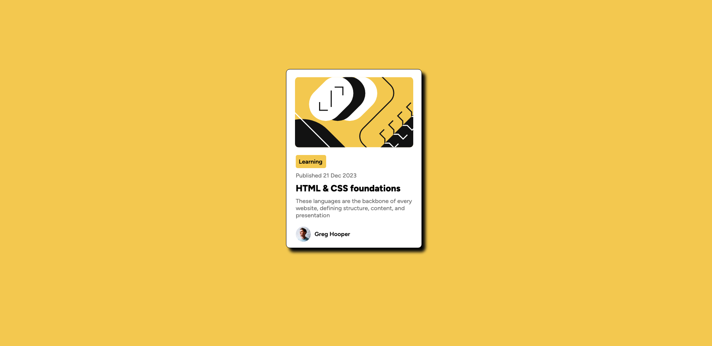

# Frontend Mentor - Blog preview card Maea's solution

Hi, my name is Maea and this is my solution for this challenge. I just learned a lot about flexbox.

## Overview

### The challenge

- Build the preview card and user should be able to hover and focus on for all interactive elements on the page.

### Screenshot



### Links

- Solution URL: [GitHub URL](https://github.com/hollyBelly2021/blog-preview-card-main)
- Live Site URL: [GitHub Pages](https://hollybelly2021.github.io/blog-preview-card-main/)

## My process

### Built with

- Semantic HTML5 markup
- CSS custom properties
- Flexbox

### Changes

- I used a soft drop shadow instead of a solid one not like the one in the original version.

```css
.main-container {
  height: 90vh;

  display: flex;
  flex-direction: column;
  align-items: center;
  justify-content: center;

  filter: drop-shadow(9px 10px 4px black);
}
```

### What I learned

- It is important to set a height when aligning items from top to botton. Remember, flex doesn't know the center.

```css
.main-container {
  height: 90vh;

  display: flex;
  flex-direction: column;
  align-items: center;
  justify-content: center;

  filter: drop-shadow(9px 10px 4px black);
}
```

- I used flex and then align-self to center align the name or one of the items.

```css
.profile-styles > p {
  align-self: center;
  font-weight: 600;
}
```

### Continued development

I will extend my learnings to grid.

## Acknowledgments

Orginal developer of this challenge.
